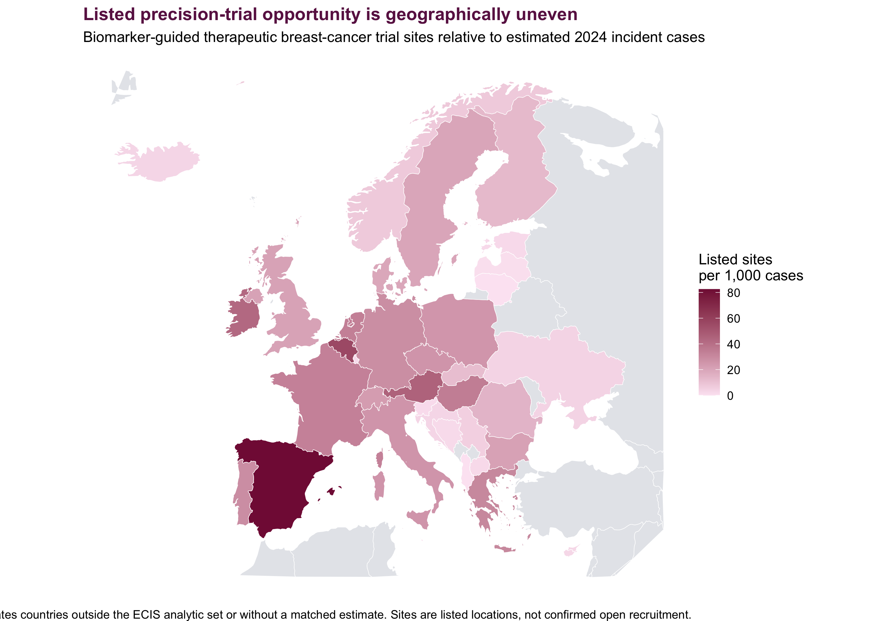
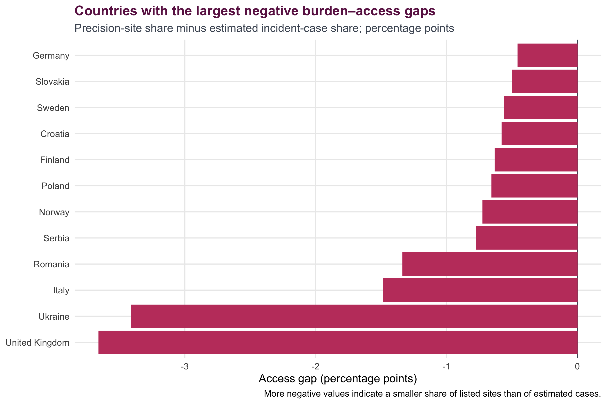
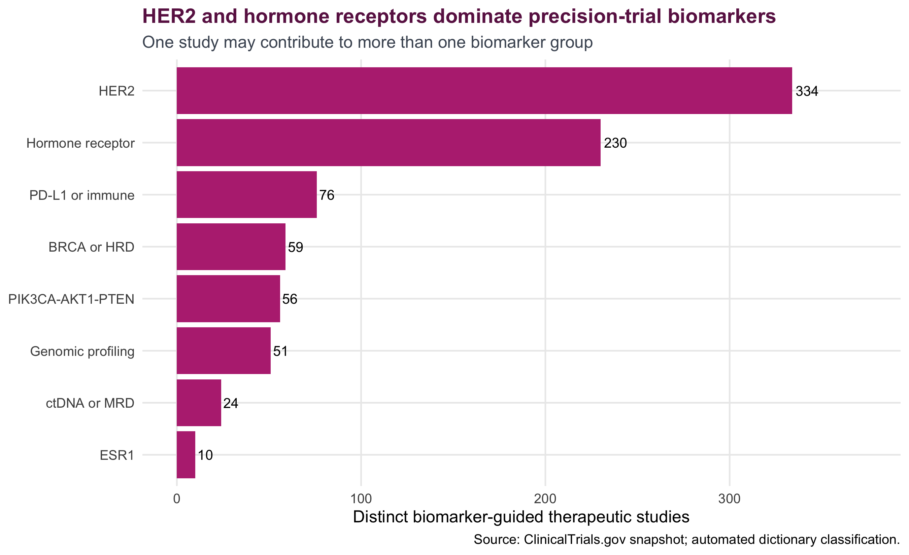

# European Breast Cancer Precision-Oncology Access

A reproducible R Markdown study of whether the European geography of active biomarker-guided breast-cancer research is proportionate to estimated disease burden—and which biomarkers, treatment classes and countries appear underserved.

## Why this project is needed

Precision medicine is changing breast-cancer classification and treatment, but its infrastructure is uneven. European public-health evidence highlights unequal access to molecular tumour boards, testing and interpretation barriers, gaps in therapy and sequencing coverage, and the need for digital infrastructure, workforce development and cross-border coordination.

The open-data research gap is more specific: there is no simple, auditable workflow connecting country breast-cancer burden with the locations and molecular portfolio of active trials. This project fills that descriptive gap without making unsupported claims about treatment uptake or effectiveness.

## Primary research question

> Across countries covered by the European Cancer Information System (ECIS), is the geographic distribution of sites listed for active biomarker-guided breast-cancer trials proportionate to estimated breast-cancer burden, and which biomarkers and treatment classes are least represented?

### Secondary questions

1. How do estimated 2024 female breast-cancer incidence and mortality vary across ECIS countries?
2. How many active interventional breast-cancer studies and listed sites are present in each country?
3. What share of studies are biomarker-guided therapeutic trials?
4. Which biomarkers—HER2, hormone receptors, BRCA/HRD, PIK3CA/AKT1/PTEN, ESR1, immune markers, ctDNA/MRD and broad genomic profiling—appear most often?
5. Which precision-treatment classes dominate the portfolio?
6. Which countries have a smaller share of listed precision-trial sites than their share of estimated incident cases?
7. Do results change when analysis is restricted to recruiting/not-yet-recruiting studies or a stricter text definition?

## Study design

This is a cross-sectional ecological analysis of public aggregate estimates and trial-registry metadata. It has two units of analysis:

- **country**, for burden and geographic access indicators;
- **NCT study**, for biomarker and treatment-portfolio analysis.

The main standardised measure is the number of distinct listed biomarker-guided therapeutic trial sites per 1,000 estimated incident cases. The burden–access gap is each country's site share minus its incident-case share.

These are research-access proxies. They do not measure actual recruitment, testing, reimbursement, treatment receipt, treatment effectiveness or survival.

## Evidence layers

| Layer | Included snapshot | Use |
|---|---:|---|
| [European Cancer Information System](https://ecis.jrc.ec.europa.eu/) | 2024 female breast-cancer incidence and mortality estimates | Disease burden denominator |
| [ClinicalTrials.gov API](https://clinicaltrials.gov/data-api/api) | Active interventional breast-cancer studies and listed locations, downloaded 12 August 2026 | Research geography and portfolio |
| Classification dictionary | Version-controlled biomarker and treatment patterns | Transparent trial classification |

The ClinicalTrials.gov snapshot contains 888 active interventional studies with at least one listed location in the 36-country ECIS analytic set. The primary dictionary-based analysis identifies 394 biomarker-guided therapeutic studies. These values will change when the data are refreshed.

## Analysis stages

1. Validate sources, identifiers, duplicate keys and missing site metadata.
2. Compare estimated incidence and mortality rates.
3. Construct a transparent biomarker-guided therapeutic study definition.
4. Describe biomarker and treatment-class representation.
5. Standardise country trial and listed-site counts by estimated incident cases.
6. Map precision-trial site density.
7. Calculate country burden–access gaps, concentration and rank correlation.
8. Repeat the geographic analysis under narrower status and text definitions.
9. Export Tableau-ready country, trial and site datasets.
10. State limitations and define the patient-level data needed for later causal research.

## Main visuals

### Geographic research opportunity



### Burden–access mismatch



### Biomarker portfolio



## Repository structure

```text
european-breast-cancer-precision-oncology/
├── european-breast-cancer-precision-oncology.Rmd
├── european-breast-cancer-precision-oncology.html
├── README.md
├── scripts/
│   └── download_open_data.R
├── data/
│   ├── raw/
│   │   ├── ecis_breast_cancer_2024.csv
│   │   ├── clinicaltrials_europe_trials.csv
│   │   ├── clinicaltrials_europe_sites.csv
│   │   ├── country_crosswalk.csv
│   │   └── precision_oncology_dictionary.csv
│   └── processed/
│       ├── tableau_country_access.csv
│       ├── precision_trial_catalogue.csv
│       ├── listed_precision_trial_sites.csv
│       ├── biomarker_trial_counts.csv
│       └── therapy_trial_counts.csv
└── visuals/
    ├── 01_breast_cancer_burden.png
    ├── 02_precision_trial_sites_map.png
    ├── 03_burden_access_gap.png
    ├── 04_biomarker_portfolio.png
    └── 05_therapy_portfolio.png
```

## Run in RStudio

Install the packages once:

```r
install.packages(c(
  "dplyr", "tidyr", "purrr", "stringr", "ggplot2",
  "knitr", "rmarkdown", "maps", "scales", "jsonlite", "tibble"
))
```

Then:

1. Clone or download the repository.
2. Open the repository folder in RStudio.
3. Open `european-breast-cancer-precision-oncology.Rmd`.
4. Click **Knit** and select **Knit to HTML**.

The report uses the included frozen data and regenerates every figure and processed CSV.

### Refresh the live sources

From the RStudio Terminal, run:

```bash
Rscript scripts/download_open_data.R
```

Then knit the R Markdown report again. Refreshing changes the research snapshot, so review and commit the updated source date and results together.

## Tableau files

- `data/processed/tableau_country_access.csv`: country map, burden, trial density and access-gap dashboard.
- `data/processed/listed_precision_trial_sites.csv`: point map using latitude and longitude.
- `data/processed/precision_trial_catalogue.csv`: filters for biomarker, therapy, phase, sponsor and status.
- `data/processed/biomarker_trial_counts.csv` and `therapy_trial_counts.csv`: portfolio charts.

## Interpretation boundaries

- ECIS figures are estimates, and estimation methods vary across countries.
- ClinicalTrials.gov is not the only European trial registry.
- A listed location is not proof that the site is currently open or enrolling.
- Dictionary matching can produce false-positive or false-negative classifications.
- Site counts do not capture capacity, travel time, referrals, cross-border access or socioeconomic barriers.
- Country-level associations cannot establish individual treatment effects or health-system quality.
- Very small countries can have unstable per-case ratios.

## Next research stages

A deeper follow-up should add national biomarker-testing availability and turnaround times; EMA indication dates linked to reimbursement and time-to-access; molecular-tumour-board coverage and trial-matching outcomes; travel-time and socioeconomic equity; and—only with appropriate governance—patient-level treatment and survival data with confounding control.

## Key sources

- [ECIS database description](https://ecis.jrc.ec.europa.eu/database-description)
- [ClinicalTrials.gov API](https://clinicaltrials.gov/data-api/api)
- [NCI breast-cancer biomarker tests](https://www.cancer.gov/types/breast/diagnosis/breast-cancer-biomarker-tests)
- [NCI breast-cancer treatment overview](https://www.cancer.gov/types/breast/hp/breast-treatment-pdq)
- [European Commission CAN.HEAL project](https://health.ec.europa.eu/non-communicable-diseases/cancer/europes-beating-cancer-plan-eu4health-financed-projects/projects/canheal_en)
- [EMA Lynparza EPAR](https://www.ema.europa.eu/en/medicines/human/EPAR/lynparza)

## Responsible-use statement

This project is for reproducible public-health research and portfolio analysis. It is not medical advice and should not be used to choose treatment for an individual patient.
