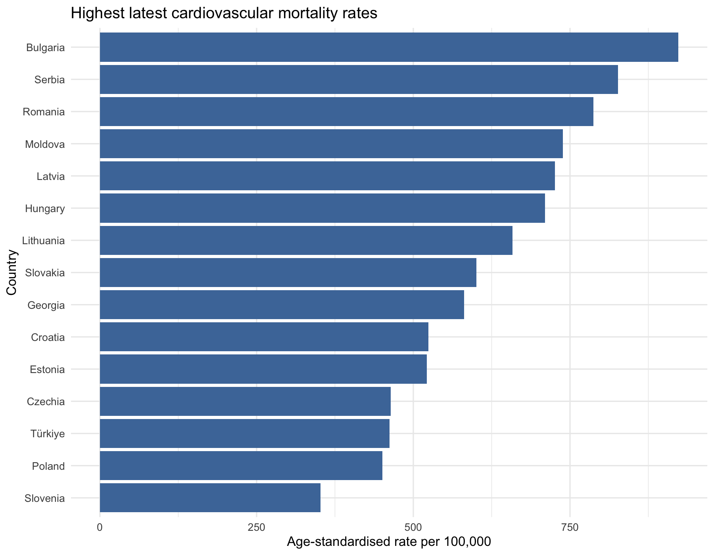

# Cardiovascular Mortality Inequalities in Europe

## Public-health question

How do cardiovascular-disease mortality rates differ across European countries, sexes and years?

This project uses age- and sex-disaggregated population mortality data to study a major European non-communicable disease challenge.

## Data

The repository includes `data/raw/cardiovascular_mortality.csv`, downloaded from [Eurostat dataset `hlth_cd_asdr2`](https://ec.europa.eu/eurostat/databrowser/view/hlth_cd_asdr2/default/table?lang=en). It contains annual standardised death rates for diseases of the circulatory system from 2015 onward:

`Country, Country_code, Year, Sex, Age_standardised_rate, Data_flag, Source`

## Analysis

- Validates and cleans mortality records.
- Compares age-standardised mortality rates across countries and sexes.
- Calculates the male-to-female mortality gap.
- Exports `data/processed/tableau_cardiovascular_mortality.csv` for Tableau.

## Run

```r
install.packages(c("dplyr", "ggplot2", "knitr", "rmarkdown", "tidyr"))
```

Open `cardiovascular-mortality-analysis.Rmd` in RStudio and click **Knit**. The analysis reads the included Eurostat CSV and recreates the Tableau export and chart.

## Example visual



## Tableau dashboard

Include a country map, a time-series trend, a sex comparison, and a ranking showing the largest mortality gaps.

## Methods and limitations

Country reporting practices and mortality-registration completeness vary. Rates are per 100,000 inhabitants and standardised to improve comparisons; remaining differences should still be interpreted cautiously.
